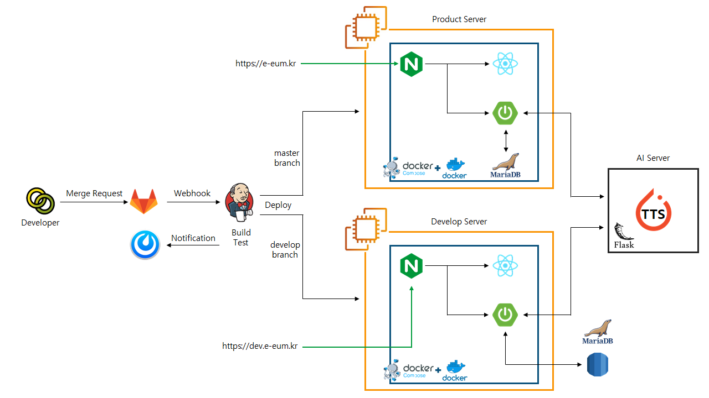

# 이음


보완대체의사소통(AAC)을 통해 언어 표현 및 이해에 어려움을 가진 사람들의 소통을 지원하는 서비스입니다.

AAC 서비스 제공자는 QR코드를 통해 AAC 사용자에게 지정된 의사소통 카드를 보여줄 수 있습니다.

<br>

<a href="https://e-eum.kr" style ="color:#8A9C3A">이음 사이트 링크 (모바일 권장)</a>

#### QR코드로 이음 서비스 체험하기


스마트폰으로 QR코드를 촬영하면 이음 사이트에 접속 가능합니다.

<br>

## 주요 기능

#### 1. QR코드를 통한 공유

* **직접 생성한 의사소통 카드 목록**을 QR코드를 통해 타인에게 보여줄 수 있습니다.


* 타인의 카드 목록을 **QR코드를 통해 내 목록에 복사**할 수 있습니다.


<br>

#### 2. 개인 맞춤형 

* **기본적인 의사소통을 위한 TTS카드**가 제공됩니다.
* 여러 카드의 **음성을 한번에 재생**할 수 있습니다.

* 로그인하면 **나만의 카드**를 생성할 수 있습니다.


<br>

#### 3. 상황별로 분류해 편리한 의사소통

* 로그인하면 **나만의 카테고리를 생성**할 수 있습니다.

* **여러 카테고리의 카드를 동시에** 사용할 수 있습니다.
* 카드를 **상황(카테고리)별로 분류해 사용**할 수 있습니다.


<br>

## 사용방법

#### Git

```bash
git clone "https://lab.ssafy.com/s04-ai-speech-sub3/s04p23b104.git"
```

<br>

#### Front End

* FE module install

```bash
npm i
```

* FE `.env` template

```
REACT_APP_API_URL=[해당 api 경로]
REACT_APP_IMG_PATH=[이미지 데이터 경로]
```

<br>

#### Back End

* `/backend/src/main/resiurces/application.properties` 추가
  * `application.properties` template

```java
#DB
spring.datasource.driverClassName=org.mariadb.jdbc.Driver
spring.datasource.url={DB_URL}
spring.datasource.username={DB_사용자_이름}
spring.datasource.password={DB_비밀번호}
server.port={port_번호}

#jpa
spring.jpa.hibernate.ddl-auto=update

#jpa query option
#spring.jpa.show-sql=true
#spring.jpa.properties.hibernate.format_sql=true

#spring.devtools.livereload.enabled=true
#spring.freemarker.cache=false
#spring.thymeleaf.cache=false
server.servlet.context-path=/api

#file path
file.path = {파일_저장_경로}
file.defaultpath = {사진_미등록_시_적용될_기본_사진_경로}

#default account
eeum.defaultemail = {미리_가입해놓은_기본_이메일}

# QR API
apiId={네이버_QR_API_ID}
apiPassword={네이버_QR_API_비밀번호}
```

<br>

* `/backend/src/main/java/com/ssafy/eeum/common/security/JwtProperties.java` 추가
  * JwtProperties template

```java
package com.ssafy.eeum.common.security;

public class JwtProperties {
    public static final String SECRET = "{JWT_SECRET}";
    public static final int EXPIRATION_TIME = {JWT_기간};
    public static final String TOKEN_PREFIX = "{JWT_Prefix}";
    public static final String HEADER_STRING = "{JWT_Header}";
}

```


#### 실행

* Front End 실행 스크립트

```bash
npm start
```

* Back End 실행 스크립트

```bash
cd ./backend
gradlew clean build
java -jar {생성된jar파일이름}
```


<br>

## 기술 스택

### Front End


#### 📚사용된 라이브러리   ----------------------


<br>

### Back End


-10.4.6-61DAFB?Style=flat&logo=MariaDB&logoColor=61DAFB)

#### 📚사용된 라이브러리   ----------------------


<br>

### 🌏인프라

#### ⚙️기술스택   ----------------------


#### 📚사용된 라이브러리   ----------------------


<br>

### AI

#### 기술스택


#### 사용한 모델


<br>

#### 배포 플로우



<br>

## 팀 소개

#### 만든 사람들

| <a href="https://github.com/dmscjf21" style ="color:#8A9C3A">AgFe</a> | <a href="https://github.com/Dong-gri-dong" style ="color:#8A9C3A">동그리동동신동</a> | <a href="https://github.com/LeeA0" style ="color:#8A9C3A">A0</a> | <a href="https://github.com/juheegg" style ="color:#8A9C3A">Dev G</a> | <a href="https://github.com/roywogur" style ="color:#8A9C3A">NetJH</a> | <a href="https://github.com/pepprbell" style ="color:#8A9C3A">피망</a> |
| ------------------------------------------------------------ | ------------------------------------------------------------ | ------------------------------------------------------------ | ------------------------------------------------------------ | ------------------------------------------------------------ | ------------------------------------------------------------ |
|                                           |                                           |                                           |                                           |                                           |                                           |
| 팀장, Front End                                              | CTO, Front End                                               | Back End                                                     | Back End                                                     | Front End                                                    | Back End                                                     |

